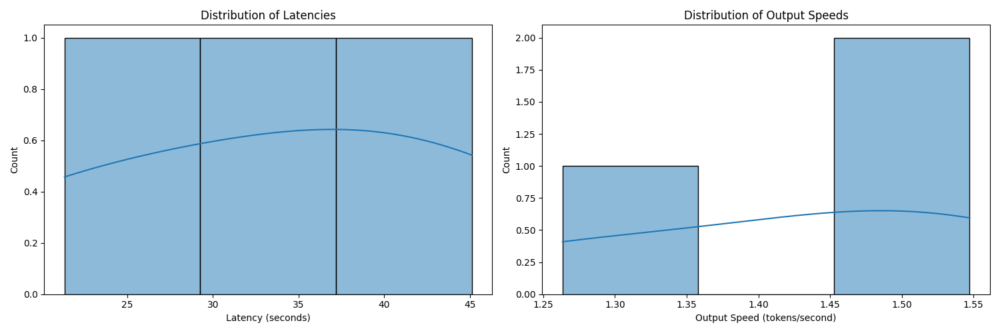
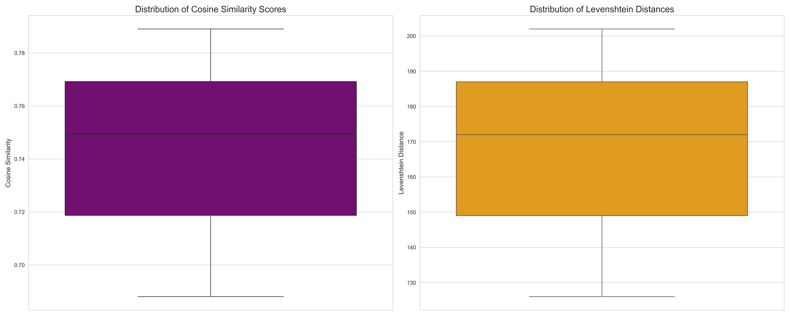

## Performance/Evaluation Results

Automated evaluation of Parrot-AI using sophisticated metrics and techniques.
Here are the results:

- **Average Latency**: 31.61 seconds
- **Average Output Speed**: 1.54 tokens/second
- **Average Cosine Similarity Score**: 0.74
- **Average Levenshtein Distance**: 166.67

**Load Test Results** (5 concurrent requests):
- Average response time: 72.47 seconds
- 95th percentile response time: Not enough data

These metrics demonstrate Parrot-AI's performance across various dimensions:
- The latency and output speed indicate the system's responsiveness.
- The cosine similarity score shows how well responses align with expected outputs.
- The Levenshtein distance shows the degree of difference between responses.
- Load test results demonstrate the system's ability to handle concurrent requests.

For detailed visualizations of these results, please refer to the following images:






**Hardware Information**:
```
CPU: arm (8 cores, 8 threads)
RAM: 8 GB
Disk: 228 GB total
OS: Darwin 23.3.0
```
