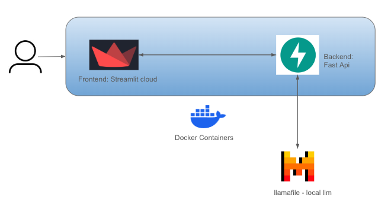

# Parrot-AI🦜🌍: AI-Powered Language Learning Conversation Generator


Parrot-AI is an AI-powered language learning tool that generates conversation and debate scripts. It uses a Streamlit frontend, a FastAPI backend, and leverages local Large Language Models to offer a personalized and interactive learning experience without relying on external APIs.

## 🎯 Project Purpose

Parrot-AI aims to provide language learners with an immersive tool to practice conversations and debates in their target language. By utilizing local Large Language Models, it offers a customized and interactive learning experience that adapts to the user's proficiency level and learning preferences.

## 💡 Motivation

The idea for Parrot-AI was born from personal travel experiences, which highlighted the importance of language in forming deep connections with locals. Traditional language learning apps weren't providing the immersive experience needed for effective learning. Parrot-AI fills this gap by offering a more conversational and context-rich approach to language learning.

## 🌟 Features

- 🌍 Supports multiple languages: English, Hindi, German, Spanish, French
- 💬 Two learning modes: Conversation and Debate
- 📊 Adjustable proficiency levels and session lengths
- 🔊 Text-to-speech functionality
- 🔄 Translation support
- 🖥️ Local LLM integration for privacy and customization

## 🌴 Project Structure

```
parrot-ai/
│
├── backend/
│   ├── Dockerfile
│   ├── app.py
│   ├── requirements.txt
│   └── src/
│       ├── __init__.py
│       ├── chatbot.py
│       └── utils.py
│
├── frontend/
│   ├── Dockerfile
│   ├── app.py
│   ├── requirements.txt
│   └── src/
│       ├── __init__.py
│       ├── conversation.py
│       └── utils.py
│
├── tests/
|   ├── Dockerfile
│   ├── backend/
│   │   ├── test_chatbot.py
│   │   └── test_utils.py
│   └── frontend/
│       ├── test_conversation.py
│       └── test_utils.py
│
├── .github/
│   └── workflows/
│       └── ci-cd.yml
│
├── .gitignore
├── docker-compose.yml
├── LICENSE
├── README.md
├── conftest.py
└── pytest.ini
```

## 🏛 Architecture

Parrot-AI uses a containerized microservices architecture. The diagram below illustrates the main components and their interactions:



Key components:
- Frontend: Streamlit-based user interface
- Backend: FastAPI server handling business logic
- Docker: Containerization of frontend and backend services
- LLM: Local language model (llamafile) for generating responses


## 🚀 Quick Start

### Prerequisites

- Docker and Docker Compose
- [llamafile](https://github.com/Mozilla-Ocho/llamafile) (Mistral Instruct 7B)

### Installation and Setup

1. Clone the repository:
   ```bash
   git clone https://github.com/mrinoybanerjee/parrot-ai.git
   cd parrot-ai
   ```

2. Download and set up llamafile (Mistral Instruct 7B):
   - Download from [llamafile releases](https://github.com/Mozilla-Ocho/llamafile/releases)
   - Make it executable:
     ```bash
     chmod +x mistral-7b-instruct-v0.2.Q4_0.llamafile
     ```

3. Build the Docker images:
   ```bash
   docker-compose build
   ```

## 🖥️ Usage

1. Start the llamafile server:

   ```bash
   ./mistral-7b-instruct-v0.2.Q4_0.llamafile --server --host 0.0.0.0 --port 8080
   ```

2. Start the Parrot-AI services:

   ```bash
   docker-compose up
   ```

3. Open your web browser and navigate to `http://localhost:8501`

[Application screenshot]

4. Configure your session in the sidebar:
   - Choose learning mode (Conversation or Debate)
   - Select target language, proficiency level, and session length
   - For Conversation mode: input roles and actions
   - For Debate mode: input the debate topic

5. Click "Generate" to create your language learning script

6. Use the provided buttons to translate, show original text, or play audio

## 🧪 Running Tests

To run the tests using Docker:

```bash
docker-compose run test
```

This will run the test suite and generate a coverage report.

## Performance/Evaluation Results

[performance/evaluation results here]

## Demo Video

[Link to demo video]

## 🛠️ Development

For local development without Docker:

1. Set up a virtual environment:
   ```bash
   python -m venv venv
   source venv/bin/activate  # On Windows, use `venv\Scripts\activate`
   ```

2. Install dependencies:
   ```bash
   pip install -r backend/requirements.txt -r frontend/requirements.txt
   pip install pytest pytest-cov
   ```

3. Run tests:
   ```bash
   pytest
   ```

## 🤝 Contributing

Contributions are welcome! Please feel free to submit a Pull Request.

1. Fork the repository
2. Create your feature branch (`git checkout -b feature/AmazingFeature`)
3. Commit your changes (`git commit -m 'Add some AmazingFeature'`)
4. Push to the branch (`git push origin feature/AmazingFeature`)
5. Open a Pull Request

## 📜 License

This project is licensed under the MIT License - see the [LICENSE](LICENSE) file for details.

## 🙏 Acknowledgments

- [Streamlit](https://streamlit.io/) for the frontend framework
- [FastAPI](https://fastapi.tiangolo.com/) for the backend API
- [llamafile](https://github.com/Mozilla-Ocho/llamafile) for local LLM support
- All contributors and supporters of the project

## 📬 Contact

Mrinoy Banerjee - [mrinoybanerjee@gmail.com]
