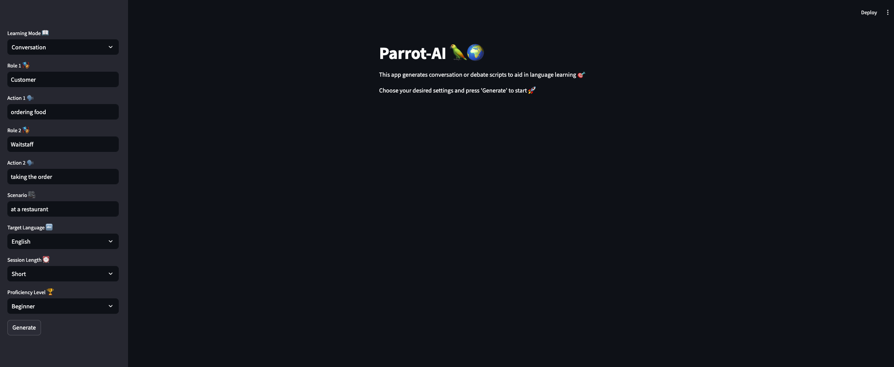
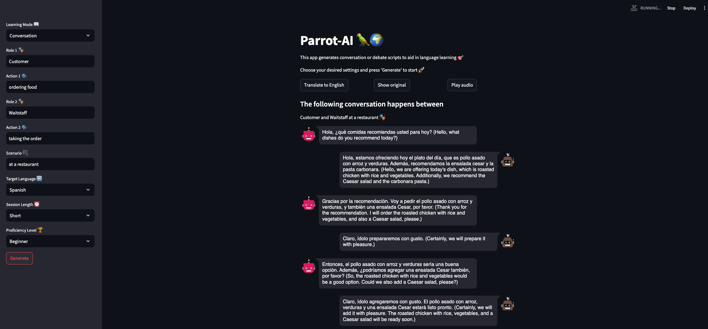
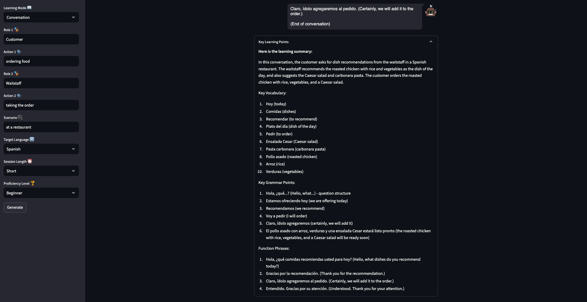
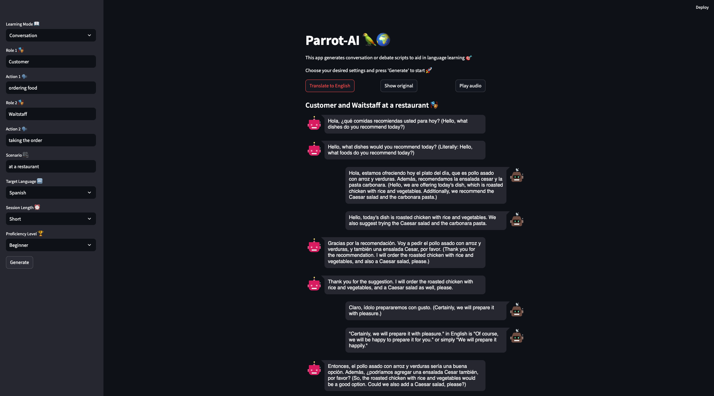
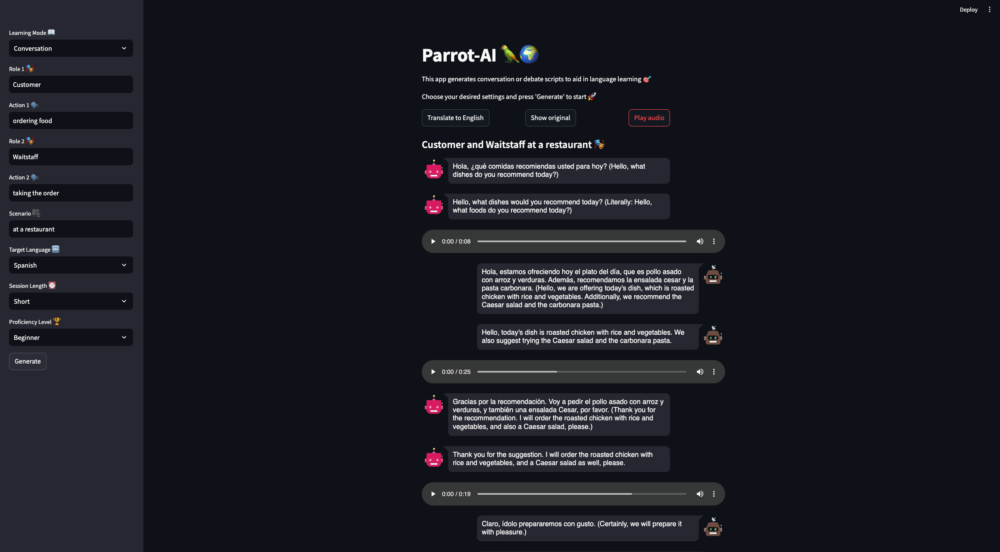

# Parrot-AI🦜🌍: AI-Powered Language Learning Conversation Generator


Parrot-AI is an AI-powered language learning tool that generates conversation and debate scripts. It uses a Streamlit frontend, a FastAPI backend, and leverages local Large Language Models to offer a personalized and interactive learning experience without relying on external APIs.

## 🎯 Project Purpose

Parrot-AI aims to provide language learners with an immersive tool to practice conversations and debates in their target language. By utilizing local Large Language Models, it offers a customized and interactive learning experience that adapts to the user's proficiency level and learning preferences.

## 💡 Motivation

The idea for Parrot-AI was born from personal travel experiences, which highlighted the importance of language in forming deep connections with locals. Traditional language learning apps weren't providing the immersive experience needed for effective learning. Parrot-AI fills this gap by offering a more conversational and context-rich approach to language learning.

## 🌟 Features

- 🌍 Supports multiple languages: English, Hindi, German, Spanish, French
- 💬 Two learning modes: Conversation and Debate
- 📊 Adjustable proficiency levels and session lengths
- 🔊 Text-to-speech functionality
- 🔄 Translation support
- 🖥️ Local LLM integration for privacy and customization

## 🌴 Project Structure

```
parrot-ai/
│
├── backend/
│   ├── Dockerfile
│   ├── app.py
│   ├── requirements.txt
│   └── src/
│       ├── __init__.py
│       ├── chatbot.py
│       └── utils.py
│
├── frontend/
│   ├── Dockerfile
│   ├── app.py
│   ├── requirements.txt
│   └── src/
│       ├── __init__.py
│       ├── conversation.py
│       └── utils.py
│
├── tests/
|   ├── Dockerfile
│   ├── backend/
│   │   ├── test_chatbot.py
│   │   └── test_utils.py
│   └── frontend/
│       ├── test_conversation.py
│       └── test_utils.py
│
├── .github/
│   └── workflows/
│       └── ci-cd.yml
├── assets/
│   └── architecture_diagram.png
├── .gitignore
├── docker-compose.yml
├── LICENSE
├── README.md
├── conftest.py
├── evaluate.py
└── pytest.ini

```

## 🏛 Architecture

Parrot-AI uses a containerized microservices architecture. The diagram below illustrates the main components and their interactions:


Key components:
- Frontend: Streamlit-based user interface
- Backend: FastAPI server handling business logic
- Docker: Containerization of frontend and backend services
- LLM: Local language model (llamafile) for generating responses


## 🚀 Quick Start

### Prerequisites

- Docker and Docker Compose
- [llamafile](https://github.com/Mozilla-Ocho/llamafile) (Mistral Instruct 7B)

### Installation and Setup

1. Clone the repository:
   ```bash
   git clone https://github.com/mrinoybanerjee/parrot-ai.git
   cd parrot-ai
   ```

2. Download and set up llamafile (Mistral Instruct 7B):
   - Download from [llamafile releases](https://github.com/Mozilla-Ocho/llamafile/releases)
   - Make it executable:
     ```bash
     chmod +x mistral-7b-instruct-v0.2.Q4_0.llamafile
     ```

3. Build the Docker images:
   ```bash
   docker-compose build
   ```

## 🖥️ Usage

1. Start the llamafile server:

   ```bash
   ./mistral-7b-instruct-v0.2.Q4_0.llamafile --server --host 0.0.0.0 --port 8080
   ```

2. Start the Parrot-AI services:

   ```bash
   docker-compose up
   ```

3. Open your web browser and navigate to `http://localhost:8501`



4. Configure your session in the sidebar:
   - Choose learning mode (Conversation or Debate)
   - Select target language, proficiency level, and session length
   - For Conversation mode: input roles and actions
   - For Debate mode: input the debate topic



5. Click "Generate" to create your language learning script

6. Scroll to the bottom of the generated conversation to see key learning points



6. Use the provided buttons to translate, show original text, or play audio






## 🧪 Running Tests

To run the tests using Docker:

```bash
docker-compose run test
```

This will run the test suite and generate a coverage report.

## Performance and Evaluation

Parrot-AI undergoes regular automated evaluations to ensure high-quality performance. Our evaluation process measures several key metrics:

- **Latency**: The time taken to generate responses.
- **Output Speed**: The rate at which the model generates tokens.
- **Cosine Similarity**: Measures how well the generated responses align with the expected outputs.
- **Levenshtein Distance**: Evaluates the degree of difference between the generated responses and expected outputs.
- **Load Testing**: The system's performance under concurrent requests.

### Latest Evaluation Results

For the most up-to-date evaluation results, please see our [EVALUATION_RESULTS.md](EVALUATION_RESULTS.md) file.

#### Key Metrics Overview:

- **Average Latency**: Measures the responsiveness of the system.
- **Average Output Speed**: Indicates the efficiency of the model in generating tokens.
- **Average Cosine Similarity Score**: Shows the relevancy and alignment of the generated responses with the expected outputs.
- **Average Levenshtein Distance**: Indicates the textual similarity between generated responses and expected outputs.

#### Load Test Performance:

- **Average Response Time**: The average time taken to respond under load.
- **95th Percentile Response Time**: The response time under load for 95% of the requests, ensuring performance consistency under high demand.

These metrics are continuously monitored in order to improve with each update to Parrot-AI. Our automated evaluation process, integrated into our CI/CD pipeline, ensures that every change is thoroughly tested for performance impacts.

### Running Evaluations Locally

To run the evaluation script locally:

1. Install all requirements:
```bash
pip install -r requirements.txt
```
2. Ensure Parrot-AI is running (both backend and frontend).
3. Run the following command:
```bash
python evaluate.py
```
4. The results will be saved in `EVALUATION_RESULTS.md` and logged to the console.

## Demo Video

[Link to demo video]

## 🛠️ Development

For local development without Docker:

1. Set up a virtual environment:
   ```bash
   python -m venv venv
   source venv/bin/activate  # On Windows, use `venv\Scripts\activate`
   ```

2. Install dependencies:
   ```bash
   pip install -r backend/requirements.txt -r frontend/requirements.txt
   pip install pytest pytest-cov
   ```

3. Run tests:
   ```bash
   pytest
   ```

## 🤝 Contributing

Contributions are welcome! Please feel free to submit a Pull Request.

1. Fork the repository
2. Create your feature branch (`git checkout -b feature/AmazingFeature`)
3. Commit your changes (`git commit -m 'Add some AmazingFeature'`)
4. Push to the branch (`git push origin feature/AmazingFeature`)
5. Open a Pull Request

## 📜 License

This project is licensed under the MIT License - see the [LICENSE](LICENSE) file for details.

## 🙏 Acknowledgments

- [Streamlit](https://streamlit.io/) for the frontend framework
- [FastAPI](https://fastapi.tiangolo.com/) for the backend API
- [llamafile](https://github.com/Mozilla-Ocho/llamafile) for local LLM support
- All contributors and supporters of the project

## 📬 Contact

Mrinoy Banerjee - [mrinoybanerjee@gmail.com]
